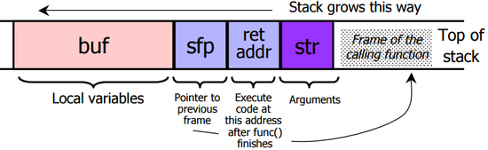

# Buffer Overflow 2
程式沒有呼叫give_shell的程式碼，但是呼叫了一個把輸入字串copy到buffer的function。

要成功使用buffer overflow來呼叫give_shell，有幾重點：
 * Calling function：
  1. push參數到stack上(reverse order)
  2. push RET位址(目前instruction pointer)
  3. jump到function位址
 * Called function：
  1. push old frame pointer(%ebp)
  2. 把frame pointer(%ebp)設成目前stack指到的位置(%esp)
  3. push local變數
 * Returning function：
  1. reset prev stack frame：%esp = %ebp, %ebp = (%ebp)
  2. jump回RET位址：%eip = 4(%esp)
 
 ```
other data, ex: buf[16]
EBP // frame pointer
EIP // RET instruction pointer
 ```
 * 填buffer的順序：宣告好大小後，會由上而下填入，所以如果overflow會先到EBP，再到EIP
 * 使用的server是big-endian還是little-endian，這次是little-endian
具體步驟：
 1. 使用gdb或objdump找到give_shell位址=0x80484ad
 2. overflow到eip，成功得到shell
 3. 印出flag破關：`cat < flag.txt`

 得到flag = controlling_%eip_feels_great
# 參考資料：
 * [駭客雜誌上的教學](http://phrack.org/issues/49/14.html#article)
